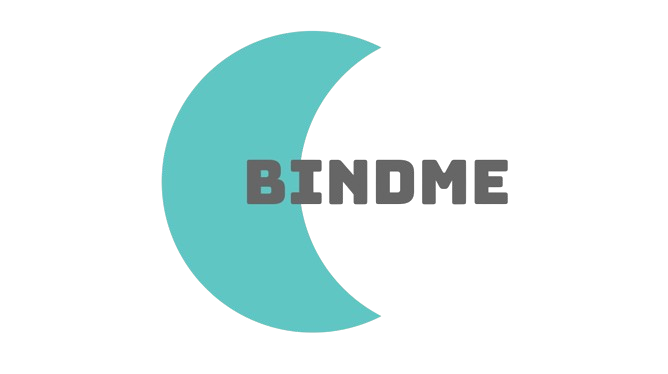

<h1 align="center">bindme</h1>

  

  Simple DI Framework for Python 3.x 🐍

<h1 align="center">Usage:</h1>

  Instruction:

  Install the package:

  <code>pip install bindme</code>

<h1 align="center">Features</h1>

  Interesting:

  * **Simple 📕** - everything you need is here! 
  * **Fast ⚡** - awesome work speed! 
  * **Low 🍃** - weighs nothing at all!

<h1 align="center">UseCases</h1>

  Examples:

